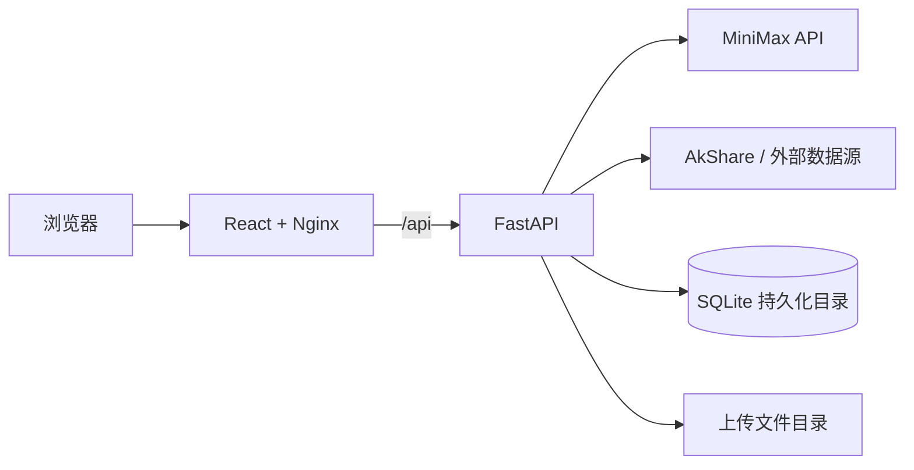

<div align="center">
  
  <h1>金融学院 AI Agent</h1>
  <p>把 AI 对话、实证分析、量化研究与学术资料检索放在同一个研究工作台。</p>
  <p>
    
    
    
  </p>
  <p>
    <a href="#核心能力">核心能力</a> ·
    <a href="#快速启动">快速启动</a> ·
    <a href="docs/部署指南.md">部署指南</a> ·
    <a href="#系统架构">系统架构</a>
  </p>
</div>

---

本项目面向金融学院的教学和研究场景。前端采用 React、Ant Design 与 ECharts，后端采用 FastAPI；模型调用使用 MiniMax，部分金融与宏观数据来自外部数据源。模型输出和数据抓取结果应由研究者核实。

## 核心能力

| 研究环节 | 页面与能力 |
|---|---|
| 提出问题 | 多轮 AI 对话、研究思路梳理 |
| 设计方法 | DID、IV、RDD、PSM 等实证分析辅助 |
| 探索市场 | 量化策略、股票与宏观数据分析 |
| 阅读材料 | 论文检索、财报解析与研报生成 |
| 输出成果 | 研究指导、结构化内容和可视化图表 |

## 系统架构



Compose 将 `data/` 与 `uploads/` 映射到宿主机；前端通过 `/api/` 代理访问后端。本机 8000 端口只绑定 `127.0.0.1`，对外发布时建议通过 HTTPS 反向代理进入前端。

## 快速启动

需要 Docker Engine 和 Docker Compose v2。在仓库根目录执行：

```bash
cp .env.example .env
# 编辑 .env，填入有效的 MINIMAX_API_KEY
docker compose up -d --build
docker compose ps
curl http://127.0.0.1/api/health
```

Windows PowerShell 使用 `Copy-Item .env.example .env`。打开 [本地页面](http://localhost/)。没有有效模型密钥时，健康检查可能正常，但 AI 请求无法成功。Python/Node.js 本地开发、HTTPS、更新与备份步骤见[详细部署指南](docs/部署指南.md)。

## 目录速览

```text
backend/             FastAPI 路由、模型服务、数据服务
frontend/            React 页面、组件、图表
docker-compose.yml   前后端容器与持久化目录
.env.example         模型配置模板（复制后填入私有密钥）
docs/部署指南.md      部署、运维与故障排查
```

## 配置与运维

| 配置 | 用途 |
|---|---|
| `MINIMAX_API_KEY` | 模型 API 密钥，Compose 启动时必填 |
| `MINIMAX_API_URL` | 模型接口地址 |
| `MINIMAX_MODEL` | 模型名称 |
| `data/`、`uploads/` | 需要备份的持久化目录 |

查看后端日志：`docker compose logs --tail=100 backend`。更新前请备份 `data/`、`uploads/` 和服务器端的 `.env`。项目目前没有通用账号权限控制，公开部署应增加访问限制。仓库尚未附独立的开源许可证文件；不要将 README 中的技术介绍视为许可证授权。

