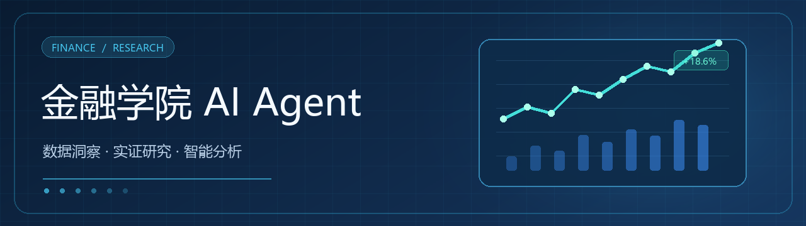

# 金融学院专属 AI Agent



[详细部署指南](docs/部署指南.md) · [Docker Compose](docker-compose.yml)

> 基于 MiniMax 大模型的金融学院智能研究助手平台

一站式金融学术研究辅助工具，集成 AI 对话、实证分析、量化策略、论文检索、宏观经济数据、AI 研报生成等功能，专为金融学研究场景设计。

---

## 功能模块

### AI 智能对话
- 基于 MiniMax-M2.7 大模型的多轮对话
- 金融领域专业 System Prompt，支持学术问答与研究指导
- Econ-Claw 提示词框架：反幻觉机制、数据原则、因果推断规范

### 实证分析助手
- 内生性诊断与因果识别策略推荐（DID/IV/RDD/PSM）
- 回归方程设计与稳健性检验方案
- Stata/Python 代码生成

### 量化策略分析
- 基于 LLM 的量化投资策略分析
- 因子模型、回测策略、风险管理
- 实时股票行情数据（AkShare）

### AI 研报生成
- PDF 财报解析（PyMuPDF/pdfplumber）
- 杜邦分析、财务指标提取
- 投资价值评估报告自动生成

### 论文检索与辅助
- 多源学术文献检索
- 文献综述结构化生成
- 论文写作指导

### 宏观经济分析
- CPI/PMI/GDP/M2/LPR 等宏观指标实时抓取
- AI 智能解读与趋势分析

### 数据检索
- 国家统计局、World Bank、FRED、OECD 等 12+ 权威数据源
- 一键跳转查询

---

## 技术栈

| 层级 | 技术方案 |
|------|---------|
| **后端框架** | FastAPI + Uvicorn |
| **AI 模型** | MiniMax-M2.7-highspeed |
| **提示词工程** | Econ-Claw 框架（反幻觉 + 因果推断规范） |
| **数据源** | AkShare（A股/宏观）、爬虫（论文/数据） |
| **前端框架** | React 18 + TypeScript + Vite |
| **UI 组件** | Ant Design 5 |
| **数据可视化** | ECharts |
| **数据库** | SQLite（SQLAlchemy ORM） |
| **部署** | Docker + Nginx |

---

## 项目结构

```
finance-academy-agent/
├── backend/                     # 后端服务
│   ├── main.py                  # FastAPI 入口
│   ├── routers/                 # API 路由
│   │   ├── chat.py              # AI 对话
│   │   ├── empirical.py         # 实证分析
│   │   ├── quant.py             # 量化策略
│   │   ├── report.py            # 研报生成
│   │   ├── paper.py             # 论文检索
│   │   ├── macro.py             # 宏观数据
│   │   ├── finance_report.py    # 财务分析
│   │   ├── research_llm.py      # 科研辅助
│   │   └── general_data.py      # 通用数据
│   ├── services/                # 核心服务
│   │   ├── llm_service.py       # MiniMax LLM 调用
│   │   ├── econ_claw_prompts.py # Econ-Claw 提示词框架
│   │   ├── akshare_service.py   # AkShare 数据服务
│   │   ├── paper_service.py     # 论文服务
│   │   ├── quant_service.py     # 量化服务
│   │   ├── report_service.py    # 研报服务
│   │   └── research_guide.py    # 科研指导
│   ├── crawlers/                # 数据爬虫
│   │   ├── stock_crawler.py     # 股票数据
│   │   ├── macro_crawler.py     # 宏观数据
│   │   ├── paper_crawler.py     # 论文爬虫
│   │   └── research_crawler.py  # 研究数据
│   ├── requirements.txt
│   └── Dockerfile
├── frontend/                    # 前端应用
│   ├── src/
│   │   ├── pages/               # 页面组件
│   │   │   ├── Dashboard.tsx    # 总览面板
│   │   │   ├── Chat.tsx         # AI 对话
│   │   │   ├── Empirical.tsx    # 实证分析
│   │   │   ├── Quant.tsx        # 量化策略
│   │   │   ├── Report.tsx       # 研报生成
│   │   │   ├── Paper.tsx        # 论文检索
│   │   │   ├── Macro.tsx        # 宏观数据
│   │   │   ├── ResearchGuide.tsx # 科研指导
│   │   │   └── FinanceReport.tsx # 财务分析
│   │   ├── components/          # 公共组件
│   │   └── App.tsx
│   ├── package.json
│   └── Dockerfile
├── docker-compose.yml
├── nginx-server.conf
├── .env.example
└── README.md
```

---

## 快速开始

推荐先按[详细部署指南](docs/部署指南.md)配置模型密钥、备份目录和 HTTPS。仓库根目录执行：

```bash
cp .env.example .env
# 编辑 .env 并填写真实 MINIMAX_API_KEY
docker compose up -d --build
curl http://127.0.0.1/api/health
```

Windows PowerShell 用 `Copy-Item .env.example .env`。浏览器打开 `http://localhost/`；本机开发的 Python/Node.js 启动步骤也在部署指南中。Compose 把数据库与上传文件持久化到仓库的 `data/` 和 `uploads/`。

---

## API 接口

| 模块 | 端点 | 说明 |
|------|------|------|
| 健康检查 | `GET /api/health` | 服务状态 |
| AI 对话 | `POST /api/chat` | 智能问答 |
| 实证分析 | `POST /api/empirical` | 因果推断指导 |
| 量化策略 | `POST /api/quant` | 量化分析 |
| 研报生成 | `POST /api/report` | AI 研报 |
| 论文检索 | `POST /api/paper` | 文献搜索 |
| 宏观数据 | `GET /api/macro` | 经济指标 |
| 财务分析 | `POST /api/finance-report` | 财报解析 |
| 科研指导 | `POST /api/research` | 学术写作 |

---

## 核心特性

### Econ-Claw 提示词框架

本项目集成了基于 [WiZENDUCK/econ-claw](https://github.com/WiZENDUCK/econ-claw) 的经济学研究提示词框架，具备：

- **反幻觉机制**：禁止编造文献、伪造数据、因果幻觉
- **数据原则**：研究问题驱动、最小可行数据、三级变量区分
- **因果推断规范**：内生性诊断、识别策略推荐、稳健性检验

### 金融数据集成

- **AkShare**：A股行情、宏观经济指标实时数据
- **爬虫模块**：学术论文、研究数据多源采集
- **PDF 解析**：财报自动提取与分析

---

## 配置说明

### 环境变量

| 变量名 | 说明 | 默认值 |
|--------|------|--------|
| `MINIMAX_API_URL` | MiniMax API 地址 | `https://minimax.chat/v1/chat/completions` |
| `MINIMAX_API_KEY` | MiniMax API 密钥 | （必填） |
| `MINIMAX_MODEL` | 模型名称 | `MiniMax-M2.7-highspeed` |

---

## 开发说明

### 添加新模块

1. 在 `backend/routers/` 创建新路由文件
2. 在 `backend/services/` 创建对应服务
3. 在 `frontend/src/pages/` 创建前端页面
4. 在 `main.py` 注册路由

### 代码规范

- 后端：遵循 FastAPI 最佳实践
- 前端：React + TypeScript + Ant Design
- 提示词：遵循 Econ-Claw 框架规范

---

## License

MIT License
